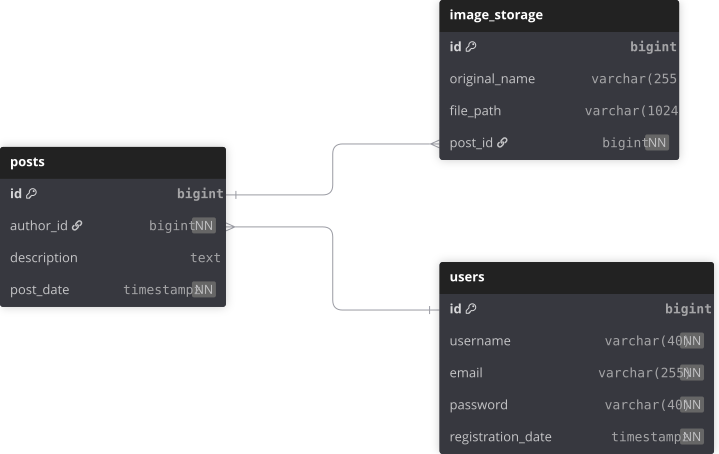

# catsgram

## Описание проекта
Проект представляет собой RESTful API, разработанное с использованием Spring Boot.

## База данных
Для хранения данных используется реляционная база данных. В проекте реализованы сущности. 
Каждая сущность имеет свои атрибуты и связи с другими сущностями.

# ER-диаграмма базы данных:

  

